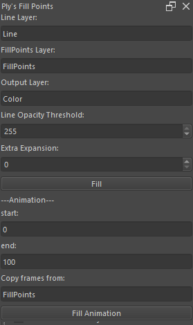

# FillPoints
A Krita plugin to speed up the process of filling colors, specially for animation

# Installation
To install this plugin open Krita and go to Settings > Manage Resources<br/>
and Open Resources Folder, inside it go to PyKrita and put the contents of the <a href = "https://github.com/PlinStudios/FillPoints/releases">zip</a><br/>
and restart Krita

# Usage
Go to Settings > Dockers and enable "Ply's Fill Points"<br/>
Now you will see the this Docker



Set your layers:<br/>
  &ensp;"Line Layer" will act as the barrier of the filling, set sensibility in "Line Opacity Thresshold"<br/>
    &ensp;&emsp;for a "Line Opacity Thresshold" lower than 255 you should add some Extra Expansion<br/>
  &ensp;"FillPoints Layer" in this layer you must put coloured points inside the lines<br/>
  &ensp;"Output Layer" is the layer with the colors expanded, it is basically and automated PaintBucketTool<br/>
  
If one of this Layers doesn't exist a blank layer will be created the moment you press "Fill"

Now press Fill and you will get your Output Layer with the colors<br/>
If you didn't close your lines correctly the color will go out of the borders<br/>
but just close your lines and press Fill again, no need to look for each color again


# Animation
For animation you'll have to set the starting frame and the end frame<br/>
Also a Layer to "Copy Frames From"<br/>
Krita API doesn't allow to create frames, so set a Layer with frames to copy them from it, I'd suggest using the same from "Line Layer" or "FillPoints Layer"

Now use Fill Animation and use the same process as the not animated case

# Building
Since this is python you don't have to compile everything, except the C++ code, so compile the cpp file with the following command
```
x86_64-w64-mingw32-g++ -O2 -shared -o fillcpp.dll fill.cpp -static-libgcc -static-libstdc++ -static
```
